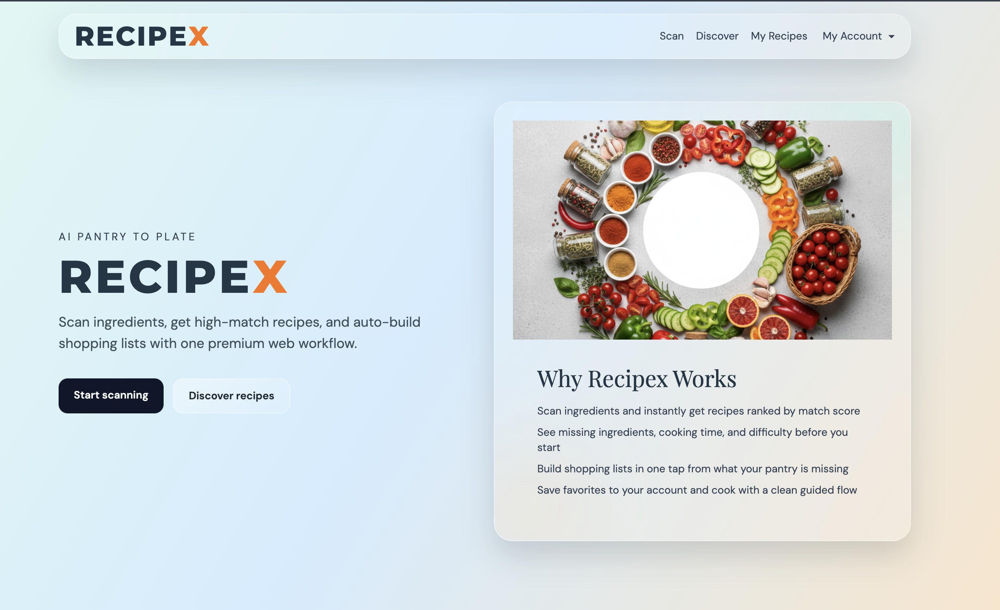

# Recipex (Web + API)

Recipex is an AI-powered recipe assistant with a separate web frontend and backend API.

## Architecture

- `recipex-web` -> Next.js 14 frontend (deployed on Vercel)
- `recipex-api` -> Express + TypeScript backend (deployed on Render)

## Core Integrations

- Groq: ingredient + dish analysis and recipe suggestions
- Spoonacular/TheMealDB: recipe data enrichment
- Supabase: auth + database (RLS-enabled)
- Cloudinary: image upload and optimization

## Local Development

### 1) API

```bash
cd recipex-api
npm install
cp .env.example .env
npm run dev
```

### 2) Web

```bash
cd recipex-web
npm install
cp .env.local.example .env.local
npm run dev
```

## Deployment

- Backend: Render (`render.yaml`, service root `recipex-api`)
- Frontend: Vercel (project root `recipex-web`)
